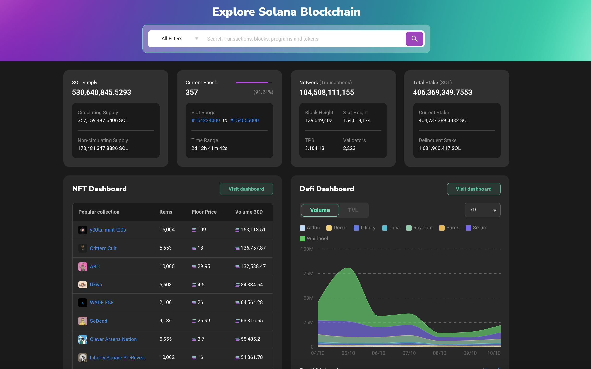

# The Block Explorer: a window to the chain

Block explorers are online interfaces which provide the user a chance to search for past and on-going transactions, wallet addresses and other useful info on a given chain. This provides a dimensionality of transparency between the chain and its users.

Solana has several block explorers to choose from:

* [Official Solana Explorer](https://explorer.solana.com/)
    
* [Solscan](https://solscan.io/)
    
* [Solana Beach](https://solanabeach.io/)
    
* [Blockchair](https://blockchair.com/solana)
    
* [SolanaFM](https://solana.fm/)
    

Throughout the tutorial, we'll see examples right from the block explorers that juxtapose the theory we discuss. Here are some of the words you'll see often throughout the tutorial:

1. Blocks, Validators and Proof of History
    
2. Accounts
    
3. Instructions and Transactions
    
4. Programs
    
5. Token Program
    
6. Token Metadata Program
    
7. Program Derived Addresses (PDA)
    
8. SPL-tokens, Fungible Assets and Non-Fungible Tokens (NFTs)
    

Let's start from the very top. What is a Blockchain?