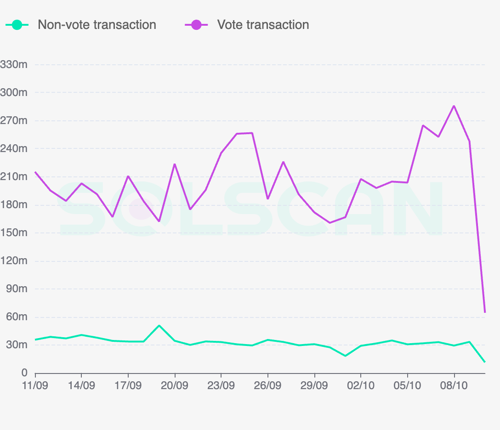

# Instructions and Transactions

**Instructions** are the basic operational units on Solana. Instructions are commands that can be bundled up together to form **Transactions**. These transactions can then be executed by a **Program** to read and/or write data from one or more **Accounts**. The instructions that form the transaction are executed atomically, or one-by-one in the order in which they were added to form the transaction. If one instruction fails, the entire transaction is invalidated.

An instruction takes the following data:

1. `program_id` of the Program which owns the accounts who's states are going to change
    
2. Array of all `accounts` the instruction intends to read/write data from.
    
3. `instruction_data` array which specifies more metadata intended for the program `program_id`.
    

One of more of such instructions are then bundled to form the transaction which needs to specify the following data before it can be executed:

1. Array of all `accounts` it intends to read/write data from.
    
2. Array of all `instructions` the transaction wants to specify in the very same order the user wants to execute them
    
3. Recent `blockhash`: this is required to prevent duplication and stale transactions. The max age of transaction is 150 blocks.
    
4. `signatures` of all accounts the given transaction intends to debit from or to write data into. This signature array needs to be in the same order of the corresponding accounts in the `accounts` array.
    

While we are talking about transactions, it's important to also talk about the Transactions per Second (TPS) of the network. Solana is famed to have one of the highest TPS of any chain.

There are two types of transactions **Vote** and **Non-Vote** transactions. Vote transactions are used to do the network validation as described in the Proof of History section and hence are not the "true" transactions being utilised for doing the actual work like transferring NFTs / tokens, bidding, selling etc. The graph above shows that in the last 7 days, the number of Vote transactions are almost 7 times as much as the Non-Vote transactions. This plays into the true **TPS (Transactions per Second)** debate of Solana: although Solana is blazingly fast with reported TPS touching averaging &gt;3k, the true TPS (removing transactions for Voting) is &lt;1.5K.

Now that we know what transactions and instructions are, we ought to understand who actually triggers/interacts with them. The answer is **Programs**.
