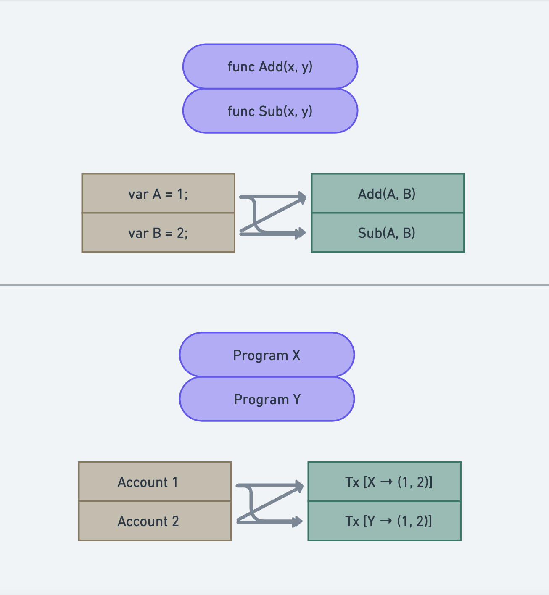
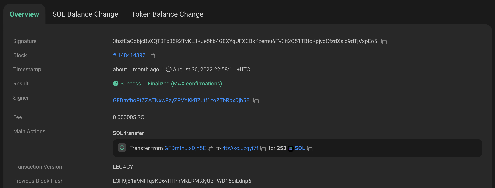
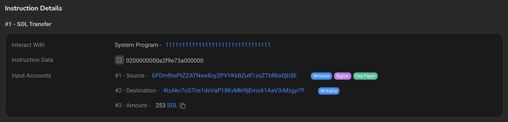

# Programs

We have mentioned **Programs** quite a lot of times in this tutorial. But what exactly are **Programs**?

The equivalent to smart contracts on Solana are **Programs**. Programs are nothing but executable code that is stored in Accounts marked as `executable`.

The way Programs differ from Smart Contracts is that Programs on Solana are stateless, i.e., they do not store the data that they are processing and acting on. Programs are stateless and all data must be passed in via separate accounts from the outside. This allows the processing of data in a parallel fashion: multiple programs can reuse the same accounts for different purposes, in different transactions.

You can imagine this parallelisation to be something similar to how functions in programming work. In programming, we can define variables to store some data. These variables can then be passed as reference to functions that make changes to these variables. In this analogy, the variables are **Accounts** and the functions are **Programs**.

Coming back to the [Solscan page](https://solscan.io/tx/3bsfEaCdbjcBvXQT3Fx85R2TvKL3KJe5kb4G8XYqUFXCBxKzemu6FV3fi2C51TBtcKpjygCfzdXsjg9dTjVxpEo5) for a transaction with signature `3bsfEaCdbjcBvXQT3Fx85R2TvKL3KJe5kb4G8XYqUFXCBxKzemu6FV3fi2C51TBtcKpjygCfzdXsjg9dTjVxpEo5`, we can start to understand what its trying to tell us.

In the transaction overview, we can checkout the block in which the transaction was executed, the fee to run the transaction, whether the transaction was successful or not and most importantly, the main actions that the transaction executes. In this case, there was a transfer of 253 SOL from wallet [`GFDmfhoPtZZATNxw8zyZPVYKkBZutf1zoZTbRbxDjh5E`](https://solscan.io/account/GFDmfhoPtZZATNxw8zyZPVYKkBZutf1zoZTbRbxDjh5E) to [`4tzAkc7cGTns1dsVaP18KvMkt9jEmzA1AaV3rMzgyi7f`](https://solscan.io/account/4tzAkc7cGTns1dsVaP18KvMkt9jEmzA1AaV3rMzgyi7f).

We can also see the same on the instruction detail. In the given transaction, only 1 instruction was executed. As it was a simple SOL transfer, the program which interacts with the transaction is the `System Program`, with hash: [`11111111111111111111111111111111`](https://solscan.io/account/11111111111111111111111111111111).

If we go back to the [Account page](https://solscan.io/account/GFDmfhoPtZZATNxw8zyZPVYKkBZutf1zoZTbRbxDjh5E#tokenAccounts) on Solscan, we can see a section for **Token Accounts** and also see some **SPL-tokens** listed. Let us see what these are.
