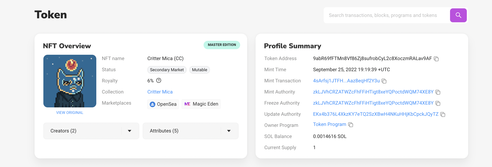

# Non-Fungible tokens (NFTs)

These tokens are the ones which have gained a lot of traction in this past year. NFTs are tokens that are non-replaceable / interchangeable. What this means is that there can not be more than one specimen of a given token. Every token is unique and can't be fractionalised. Here are their properties:

1. `supply` = 1
    
2. `decimal places` = 0
    

NFTs are usually represented by a visual asset: it could either be an image, video or gif. The asset could also be an mp3 file thus allowing the possibilities of music NFTs.

An example of an NFT on Solana can be seen here: [Token Address `9abR69fFTMn8Vf86Zj8sufrobCyL2c8XoczmRALav9AF`](https://solscan.io/token/9abR69fFTMn8Vf86Zj8sufrobCyL2c8XoczmRALav9AF).

This NFT belongs to the well known **Critters Cult Collection**. In the NFT Overview section, we can see a **Royalty** set by the creator. This is a fee which is paid to the original creator of the NFT, on every trade of the given NFT. We can also see a **Creators** tab, which lists the addresses of the original creators of the collection and their corresponding percentages out of the total royalties they receive. On the **Attributes** tab, we can see some specific attributes of the NFT. These attributes vary across NFTs in the collection and hence give uniqueness to each NFT depending on the specific combinations of the attributes. In the Profile Summary, we can also see that the supply is 1, hence ensuring that its an NFT.

Let's check out the **Metadata** tab of the NFT which showcases some interesting information. There are two sets of metadata that we can see in this tab: **on-chain** and **off-chain** metadata.

Here's the on-chain metadata: [https://solscan.io/token/9abR69fFTMn8Vf86Zj8sufrobCyL2c8XoczmRALav9AF#metadata](https://solscan.io/token/9abR69fFTMn8Vf86Zj8sufrobCyL2c8XoczmRALav9AF#metadata)

One can read more about how to mint an NFT and set the metadata for the NFTs on [Metaplex docs](https://docs.metaplex.com/programs/candy-machine/).
