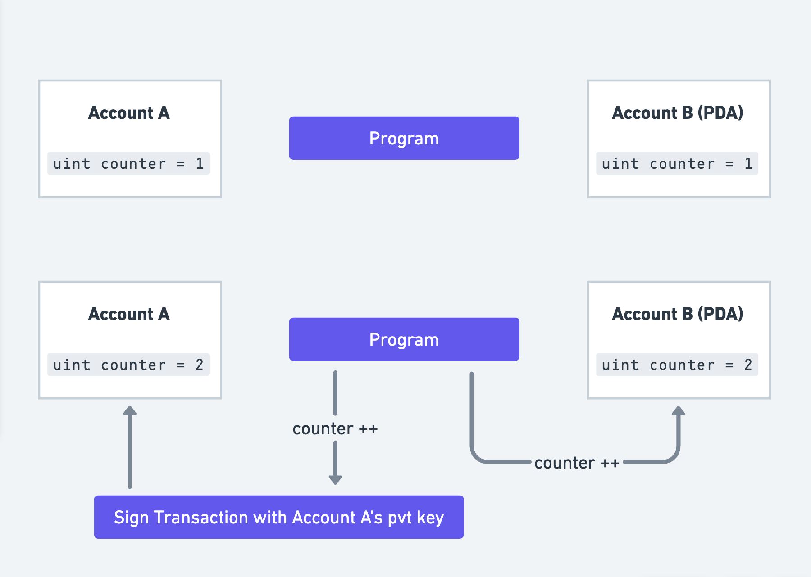
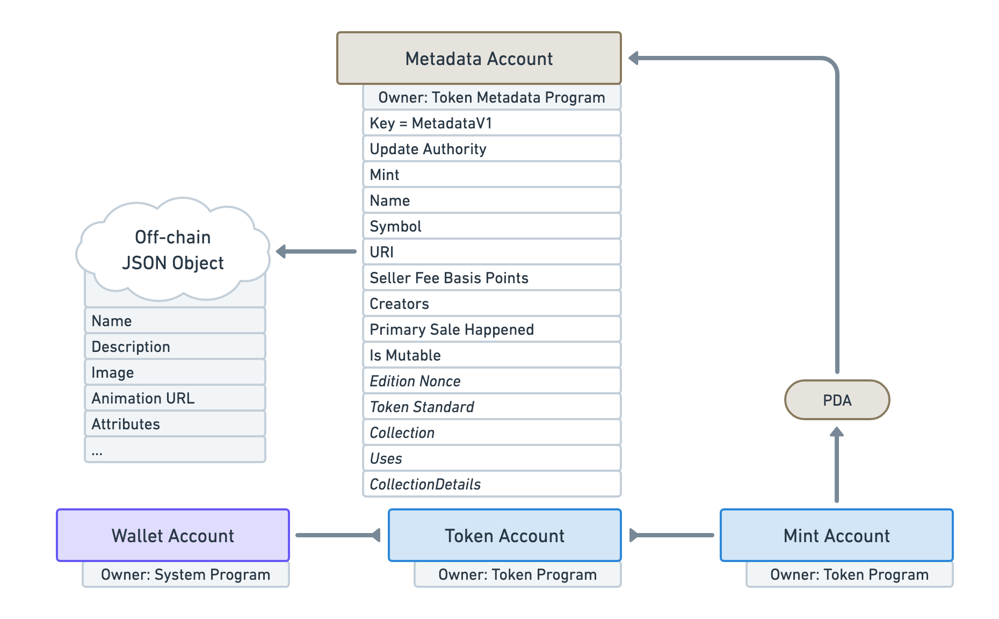
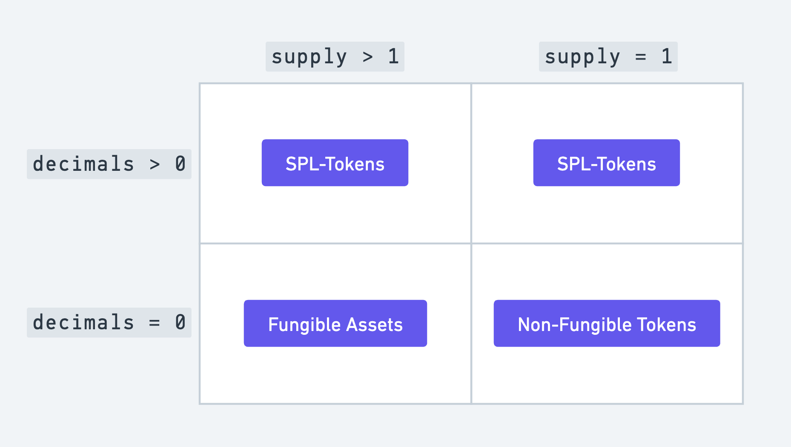

# Token Metadata Program

The Token Metadata Program is used to attach additional data to all tokens on Solana. This allows wallets, dapps and even block explorers to present tokens in a standardized way, creating a uniform user experience across the ecosystem.

To enhance Mint Accounts with additional metadata, the Metadata program uses a concept called Program Derived Addresses (PDA).

> ## Program Derived Addresses (PDAs)
> 
> When we discussed **Accounts**, we talked about the need for the account's owner to sign transactions whenever a program makes a change to the said account.

> This is problematic and not always possible. Imagine a use-case where we are counting the number of tokens in a given account and this number needs to be saved on-chain. The account's owner will have to sign transactions each time this number changes.

> An ingenious solution to this is PDAs. PDAs envelop accounts that can be programmatically controlled by certain programs. This allows programs to sign on behalf of these accounts without requiring a private key, as shown below.

> PDAs are deterministically derived from a `program_id` and a string (also known as seeds) like `"auction_house"` or `"token_metadata"`. If you want to dive deep into how PDAs are generated, I highly recommend reading [Solana Cookbook's PDA guide](https://solanacookbook.com/core-concepts/pdas.html#generating-pdas).

To attach additional data to a Mint Account, the Token Metadata Program derives a PDA from the Mint Account’s address. This PDA is then used to store a **Metadata Account** with the **Mint Account** using a PDA as shown below.

A Metadata account stores lots of useful information that Mint Accounts could not provide. This account also has a `URI` field which points to an off-chain JSON object. This object saves information like the image and attributes for an NFT.

The combination of the `Token Program` and the `Token Metadata Program` allows tokens to be categorised into three broad categories depending on two characteristics:

1. `supply`: the total number of tokens in circulation.
    
2. `decimal places`: the number of decimals points a token is allowed to have. For example: SOL is allowed to have 9 decimal points, which means, 10^-9 SOL is a valid denomination and can be transferred between wallets.
    

