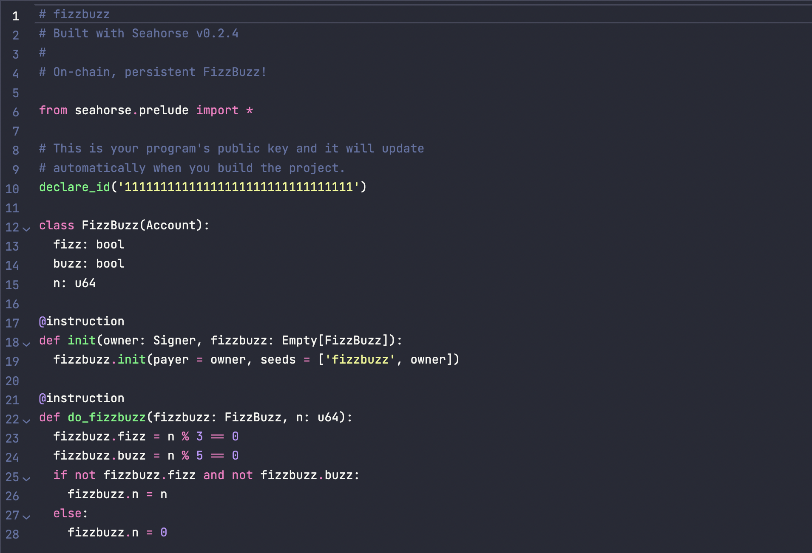

# Add Accounts
> As mentioned in the [accounts section](../introduction-to-solana-core/accounts.md), decentralised apps need to track the current state: number of tokens, NFTs transferred, current highest bidder in an auction, orders for a token on a dex etc. These states need to be saved in data storing units on-chain, called `accounts`.

As you'd have imagined already, we will have to store the state, ie, the number of votes for each candidate of the poll at a given time somewhere. To store this state, we will create and use an account. Accounts are data storing units in Solana. We will explore them more throughout this course.

Open `poll.py` and you will see this:


- Firstly, replace all instaces of "FizzBuzz" from the file and replace it with "Poll"
- Also remove everything after line 11. Your `poll.py` should look like this: 
```

# Poll
# Built with Seahorse v0.2.4
#
# On-chain, persistent Poll!

from seahorse.prelude import *

# This is your program's public key and it will update
# automatically when you build the project.
declare_id('11111111111111111111111111111111')

```

We will discuss what `declare_id` does when we discuss `Programs`. But essentially, the program address is declared within the `declare_id`. More on it later.

In Seahorse, accounts are represented by classes derived from the `Account` base class. 
Let's add a `Poll` account to the `poll.py` file which will represent the poll state.

```py

class Poll(Account):
  ethereum: u64
  solana: u64
  polygon: u64

```

- The individual fields of the class represent the data which will be stored in the account.
- In our case these fields are `ethereum`, `solana` and `polygon` that represent the number of votes given to these chains respectively.
- We use the unsigned `u64` data type to store votes as votes can never be negative.

> Using the `uX` notation is not usual to Python. In Python, integers are by default unsigned of default datatype `u32` for 32 bit systems, and `u64` for 64 bit systems. In case of Seahorse, its necessary to define their underlying data type by using type-annotated fields with no default value. `u64` for example corresponds to an unsigned integer with 64 bits.

`poll.py` will look like this:

```py

from seahorse.prelude import *

declare_id('11111111111111111111111111111111')

class Poll(Account):
  ethereum: u64
  solana: u64
  polygon: u64

```

Now that we know that accounts will be used to store the poll state on-chain, how can one interact with them to write or modify data?

Instructions!