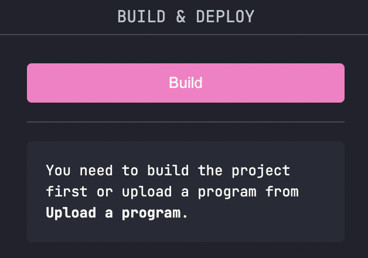
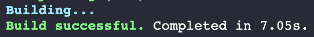
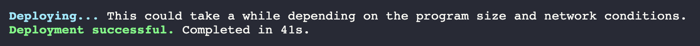
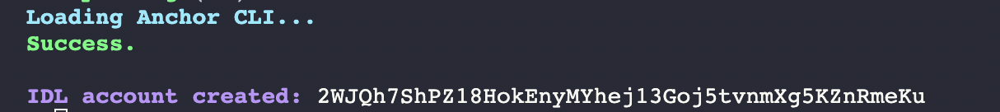
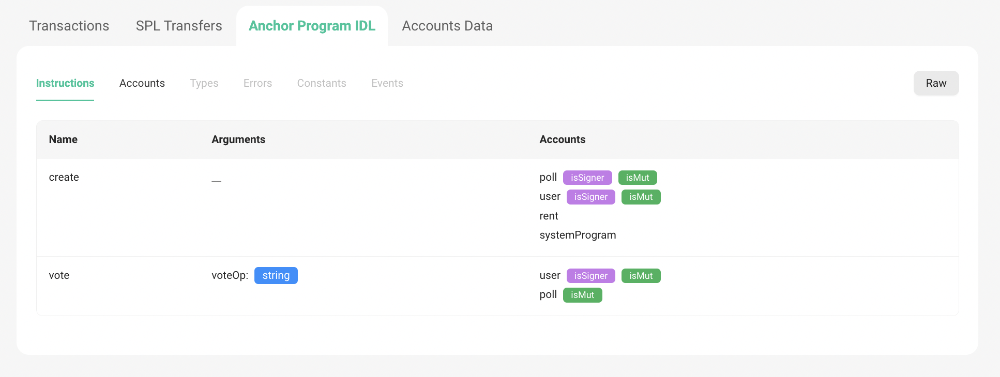
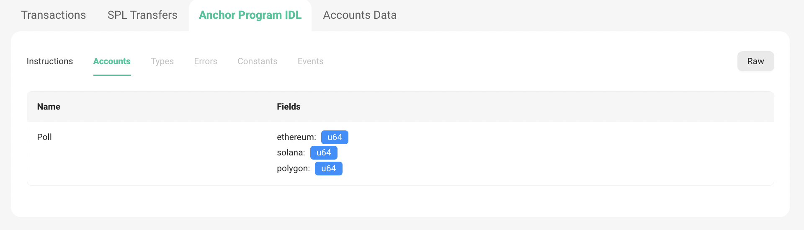
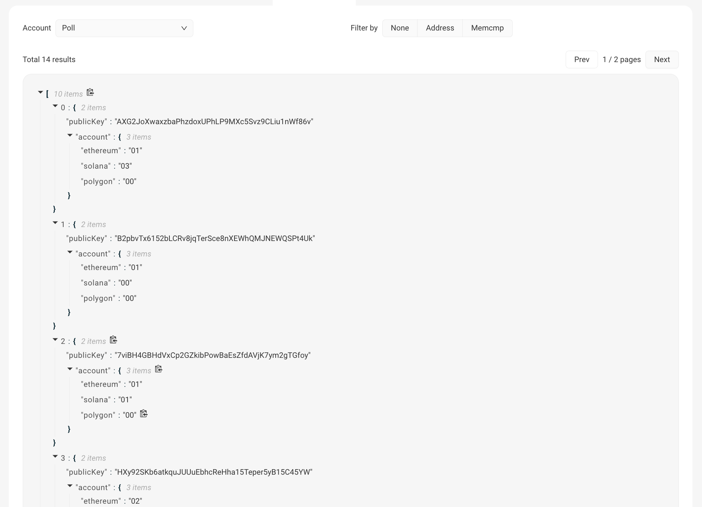

# Build and Deploy

## Building our Program

Now that we have written our program, we need to convert the Seahorse program, written in Python and convert it into an Anchor program written in Rust. We won't go into the inner mechanisms of how this happens, but if you want to delve deep into it, read up the [Seahorse Compiler Overview](https://github.com/solana-developers/seahorse/tree/main/src/core).

- On Solana Playground, press Cmd + Shift + B, or press the Build and Deploy icon on the sidebar.

- This will open up this in the sidebar:



- Press on the build button and wait for a few seconds. If everything goes well, you should see something like this:




## Deploying our Program

- Once built successfully, we will now Deploy our program, or in other words, publish our program on-chain. This however costs some Solana. We will airdrop some more on our dev wallet. On the CLI:

```
solana airdrop 2
```

- Now we can press the Deploy button on the sidebar to deploy our program. We will see that some SOL will get deducted from our dev wallet. It should take a few seconds, but once done you should see something like this:



Congrats! Your first Solana Program is deployed on-chain.

## Initialise and Export IDL

The final step is to initialise and Export our IDL. 

- We initialise the IDL to make the struct of our Poll account publicly available.

- Pressing on IDL and then choosing the `Initialise` button would make an IDL account on-chain, like this:



> This helps indexers in parsing data and other applications showing our Poll States in nice UIs. This is another contributing factor to Solana's "composability", which means that applications can be built upon each other and interact with each other with ease!

- For example, visit: https://solscan.io/account/5MgjVvaSLj6zmxuYhSST1M4LBiXoiSMrJPDZTRPQoiw8?cluster=devnet#anchorProgramIDL
Here we can see the different Instructions and Accounts are programs owns. 




- We can also go to the `Accounts Data` [tab](https://solscan.io/account/5MgjVvaSLj6zmxuYhSST1M4LBiXoiSMrJPDZTRPQoiw8?cluster=devnet#accountsData) and select `Poll` account in the `Account` drop down menu to see our various Poll Accounts and their states, that have been made by different users already trying this program. Pretty neat :)



- Finally, we should export the IDL, which will be used while making our frontend. You can do so by pressing the `Export` button in the IDL section. This will download the IDL as a `idl.json` JSON file.