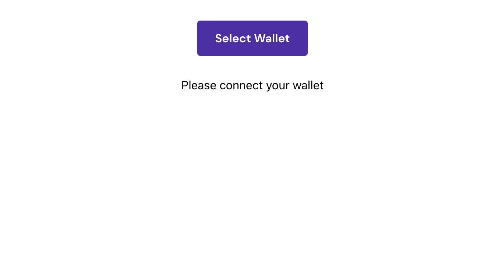
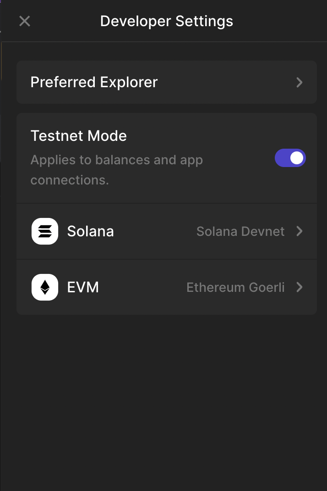
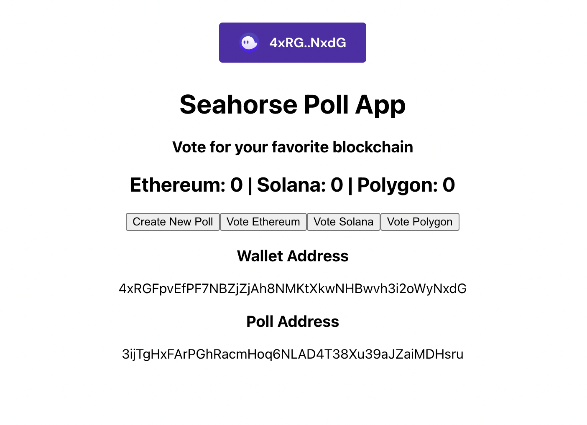
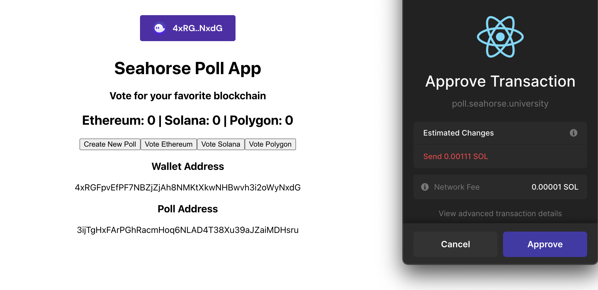
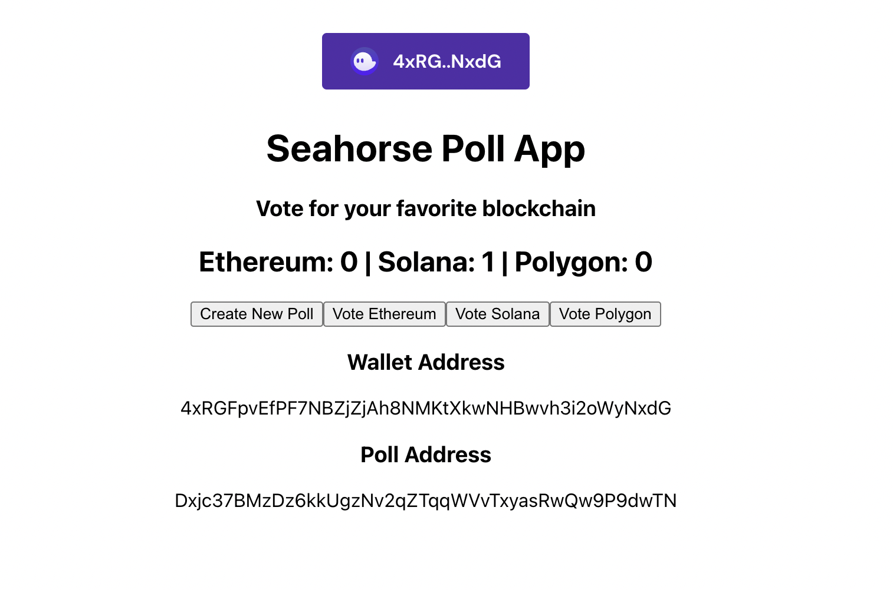

# Build and Run the App

To build and run the app:

```
npm start
```

- This will open the app in your localhost server, usually: [http://localhost:3000/](http://localhost:3000/)
- It should look something like this:



- Press on `Select Wallet` and choose Phantom. If you don't already have it, install the chrome extension from here: [https://phantom.app/download](https://phantom.app/download)

- Make sure you switch networks by going on Settings -> Developer Settings -> Turn on Testnet Mode. This will switch your wallet to devnet.



- Once you're connected, you will see this screen:



- Here we can see our connected wallet address and our Poll address (already created by someone). If you don't see a Poll address we can create a new one.

- Press on `Create New Poll`. This will pop open the Phantom signature request modal for you to approve it.



- On approval, you will see that a new Poll has been created as the Poll address will change.

- Its time to vote! Vote for Solana, this will open another wallet modal. On approving, we will see that the Votes for Solana are incremented to 1.



- Keep playing with it till you get a feel of what's happening.
