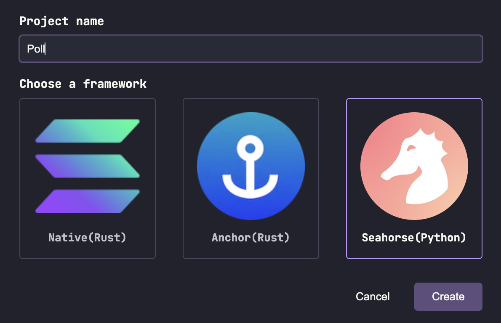
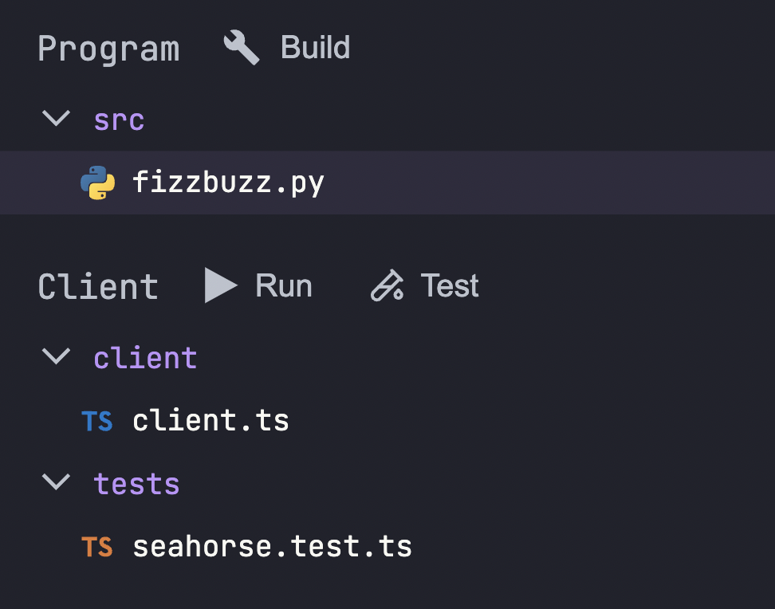
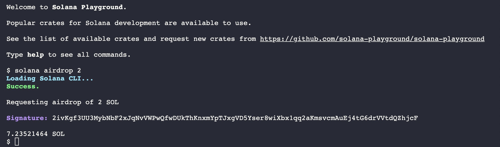
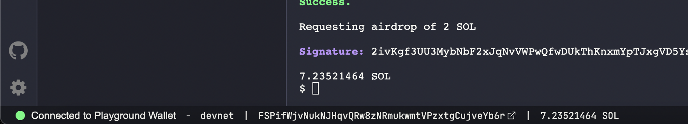

# Solana Playground
Solana Playground is browser based application that will let you write, build, and deploy on chain Solana programs, all from your browser. This is very useful if we don't want to deal with a million dependancies and quickly want to bootsrap our Seahorse programs. It even has an inbuilt burner wallet so you won't have to worry about connecting external wallets or approving transactions. 

For our first Seahorse program, we'll use Solana Playground to quickly get up and running without worrying about installing CLI tools or dependancies. Let's get started!

## Getting Started with SolPG

- Go to [Solana Playground](https://beta.solpg.io/) and make a new Seahorse Project, and name it **Poll**. 



- This will create a Seahorse project for you and you won't have to worry about any dependancies. SolPg creates the Seahorse project with the following structure:

```
Poll
|\_ src
    |\_ fizzbuzz.py
|\_ client
    |\_ client.ts
|\_ tests
    |\_ seahorse.test.py
```


- `src/fizzbuzz.py` currently contains a boilerplate starter program written in Seahorse Lang. We can already see the structure that a Seahorse program follows, but we'll come to that later.

- `client/client.ts` can host Typescript code that can be used to simulate actual frontend user experience of your app. In this file, we can add code to simulate the interaction of our frontend with our program.

- `tests/seahorse.test.ts` will contain our Anchor Unit Tests written in Typescript. This goes a level deeper than `client.ts` and is essential to check if our Program is functional and working as expected or not.

- There are three more tabs: Build & Deploy, Test and Tutorials. We'll come back to them while testing and deploying our program

- For now, rename `fizzbuzz.py` to `poll.py`

- In the terminal at the bottom of the screen, **airdrop** 4-5 SOL to the burner wallet on devnet:
```
solana airdrop 2
```

> Don't airdrop more than 2 SOL at once due to RPC limits on devnet airdrops

- We will airdrop more SOL to our wallet when we are deploying our program. But for now, the balance will be visible at the bottom of the screen.


We are now ready to edit `poll.py` and write our first Seahorse program!

<!-- - **Build** the program to make Rust artifacts of your Seahorse program.
- **Deploy** the program: this will publish your program on-chain and provide you with an IDL json file which we will use later on for building the frontend. Deployment usually costs around 3-4 SOL depending on how computationally heavy your program is.

> ### Interface Definition Language (IDL)
> In Solana programming, an Interface Definition Language (IDL) specifies a program's public interface. It defines a Solana program's account structures, instructions, and error codes. IDLs are `.json` files used to generate client-side code, allowing users to easily interact with a Solana program

Once you deploy your program successfully, you will notice that the program ID in `declare_id` will change to the actual deployed program ID.
You will also see something like this on the SolPG terminal:
```
Deploying... This could take a while depending on the program size and network conditions.
Deployment successful. Completed in 33s.
```

You will also get a Solana Explorer notification to check the deployement transaction which will be similar to the following:
<https://explorer.solana.com/tx/2FAiWj1iBDm1BncVd6JzwkGKc9fcvw9DdQAkgHSqMUquigF62YPN5jgsXeX6KZGPcemRRMT23c9Fv6zTJD5a4HFQ?cluster=devnet>

Congrats! Your first Solana Program is on-chain. -->