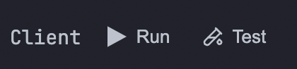
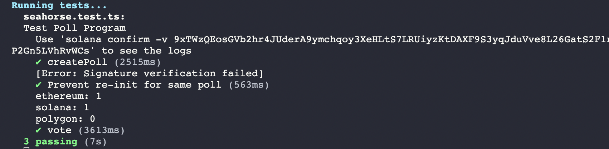

# Running Unittests

Its time to run our awesome unit tests!

- Go back to the explorer tab by clicking on the first icon the sidemenu, or pressing Cmd+Shift+E.
- Press the Test icon under Client

- The test results if successful, should show like this on the console

Congrats! This wraps up our first Anchor test. Not too bad, was it?

Let's go to the third and final step of creating our Poll App: the frontend!