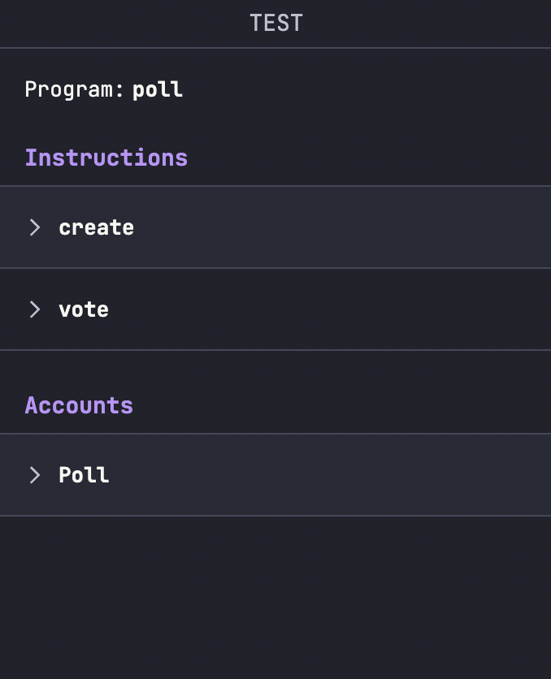
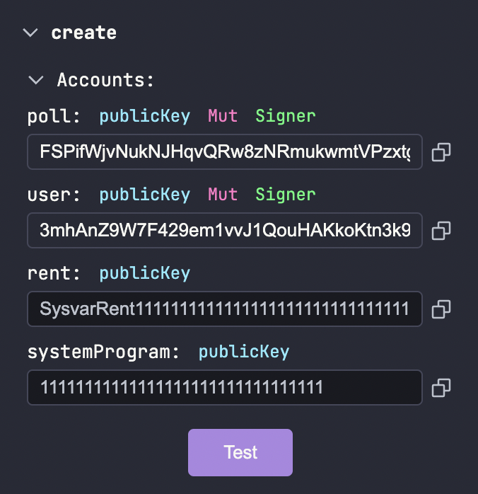
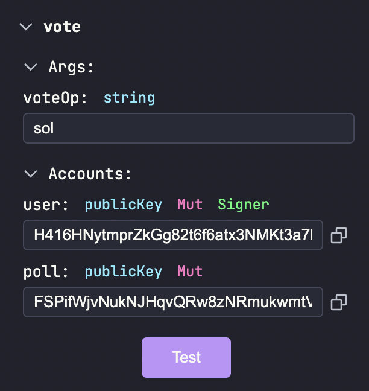
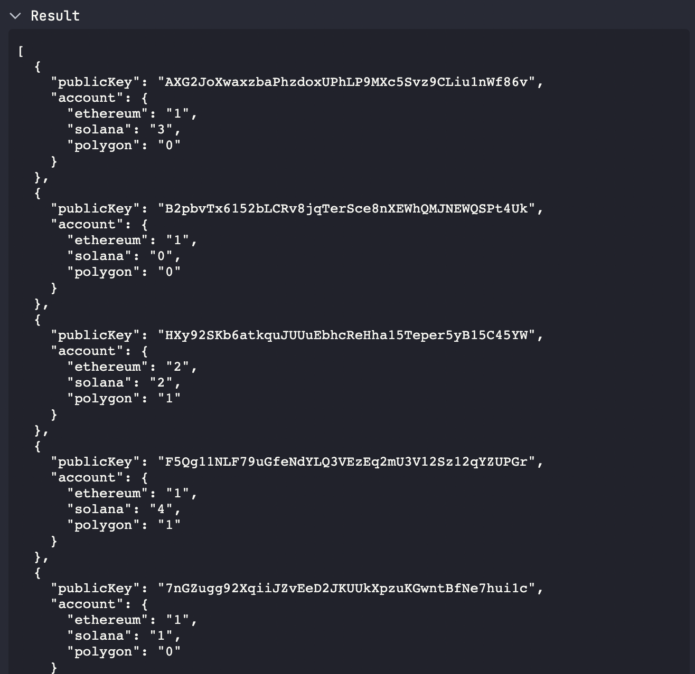

# Testing with SolPg UI
Solana Playground provides a UI to trigger instructions and fetch program accounts. Once we are in the Test tab, we can see our 2 instructions in the sidebar



## Create Instruction
First up we'll test our `create` instruction which creates a new Poll

- Press on the `create` button under `Instructions`
- Choose `Random` in `poll` dropdown. This is because the `poll` address is a random publicKey. Copy this address and paste it for later use.
- Choose `My address` in `user` dropdown
- Press Test
- You should see on the terminal: `Test 'create' passed.`



## Vote Instruction 

- Press on the `vote` button under `Instructions`
- Type `sol` in the `voteOp` to vote for Solana
- Choose `My address` in `user` dropdown
- Paste the address that we copied earlier which points to our poll account under `poll`
- Press Test
- You should see on the terminal: `Test 'vote' passed.`



## Fetch Accounts

We can also fetch all of the created Polls for our program by pressing the `Fetch All` button under the `Accounts` section. It will result in something like this:



This shows the current state of all the Poll accounts active under our program and also includes the address of the Poll we just created.

Instead of fetching all accounts, we can fetch the state of our Poll account (the address we copied earlier) by pasting the Poll address. As we have voted once for Solana, the state looks like this:

```
{
    "publicKey": "FSPifWjvNukNJHqvQRw8zNRmukwmtVPzxtgCujveYb6r",
    "account": {
        "ethereum": "0",
        "solana": "1",
        "polygon": "0"
    }
}

```

This shows that our poll creation and voting instructions have passed with flying colors!