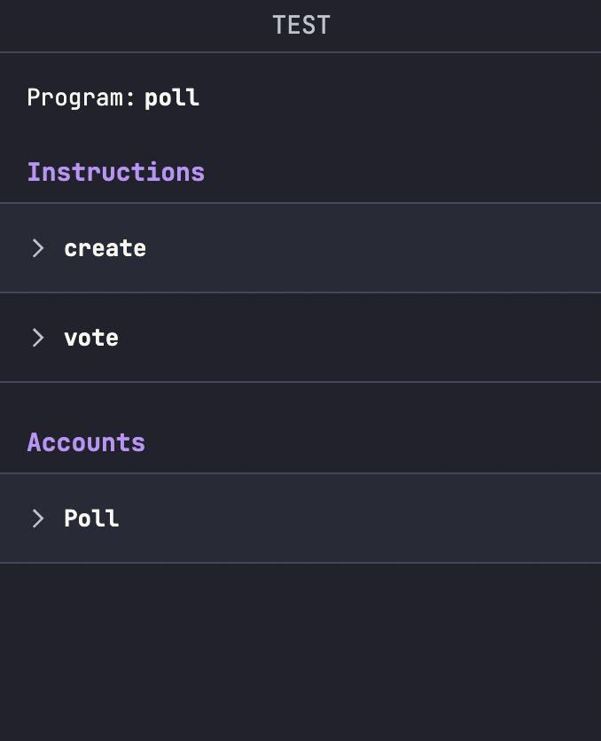
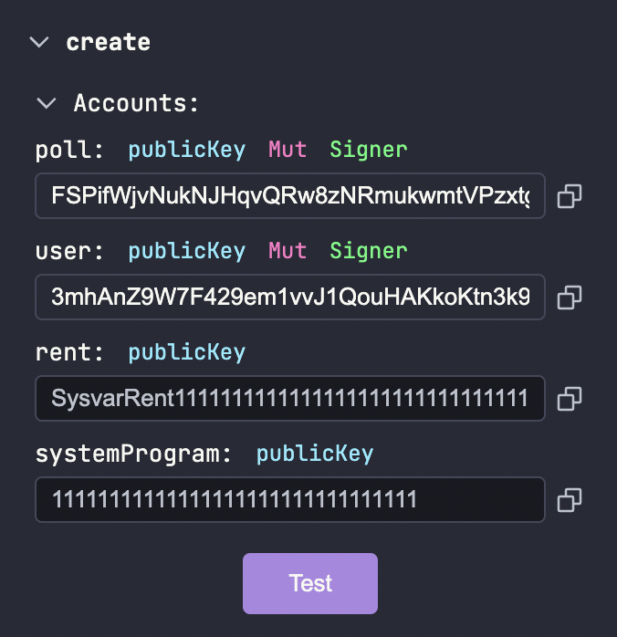
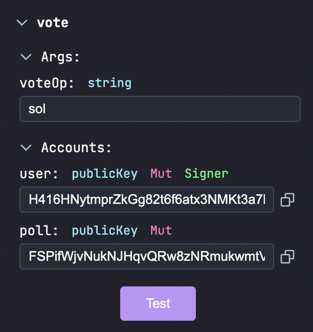
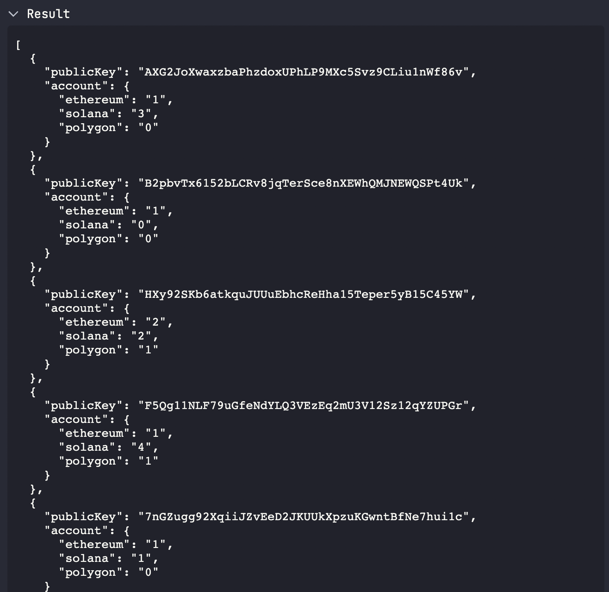

# Testing

Although we've written the program, we have no clue if the logic works as expected.

Luckily Solana Playground provides an awesome User Interface to play around with our program and check its working or not. Let's head to the Test tab by selecting it in the sidemenu, or pressing Cmd + Shift + D.

## Testing with SolPg UI
Solana Playground provides a UI to trigger instructions and fetch program accounts. Once we are in the Test tab, we can see our 2 instructions in the sidebar

### Create Instruction
First up we'll test our `create` instruction which creates a new Poll

- Press on the `create` button under `Instructions`
- Choose `Random` in `poll` dropdown. This is because the `poll` address is a random publicKey. Copy this address and paste it for later use.
- Choose `My address` in `user` dropdown
- Press Test
- You should see on the terminal: `Test 'create' passed.`

### Vote Instruction 

- Press on the `vote` button under `Instructions`
- Type `sol` in the `voteOp` to vote for Solana
- Choose `My address` in `user` dropdown
- Paste the address that we copied earlier which points to our poll account under `poll`
- Press Test
- You should see on the terminal: `Test 'vote' passed.`

We can also fetch all of the created Polls for our program by pressing the `Fetch All` button under the `Accounts` section. It will result in something like this:

This shows the current state of all the Poll accounts active under our program!

## Testing with Anchor

We can test our program using the Anchor framework more systematically. Don't worry, you won't require any Anchor expertise here, just some basic Javascript knowledge will do!